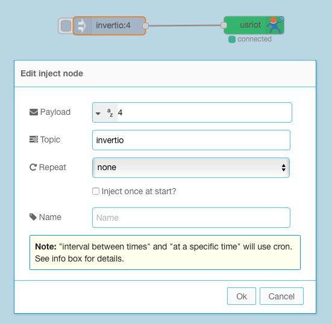
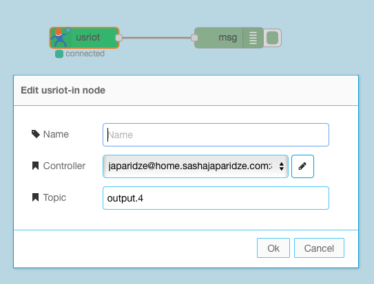
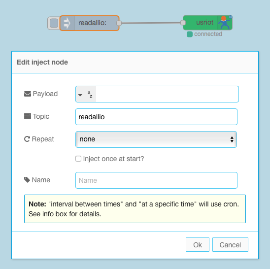

node-red-contrib-usriot
========================

[Node-Red][1] USRIoT nodes for communicating with a USRIoT devices.

Based on [usriot.js][2].
Read protocol documentation in [GPIO control protocol V1.8.pdf][4]
#Install

Run the following command in the root directory of your Node-RED install

    npm install node-red-contrib-usriot

#Nodes

Send invert command to output 4 and read response
-------

And read response from output 4
-------

Send read all IO command
-------

#Author

[Alexander Borovsky][3] 

[1]:http://nodered.org
[2]:https://www.npmjs.com/package/usriot.js
[3]:https://github.com/aborovsky
[4]:http://www.usriot.com/download/LonHand/GPIO%20control%20protocol%20V1.8.pdf